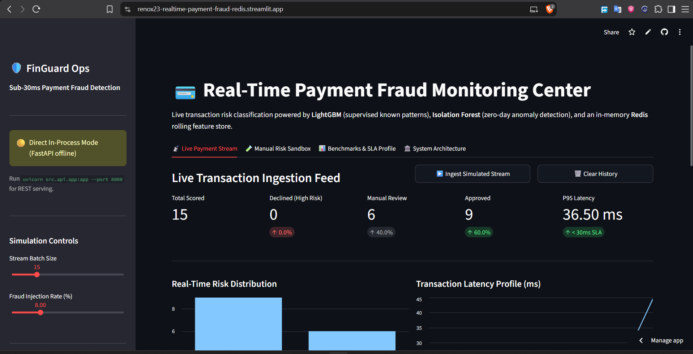
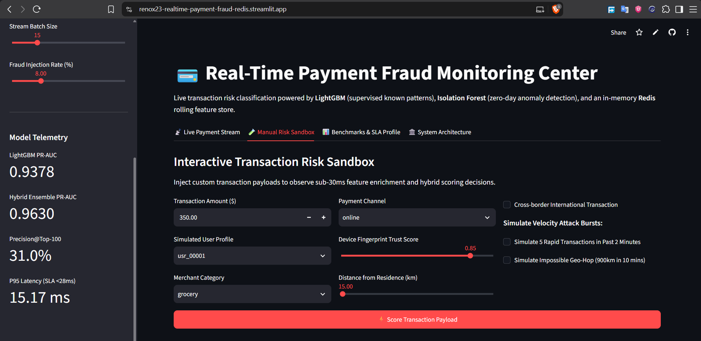
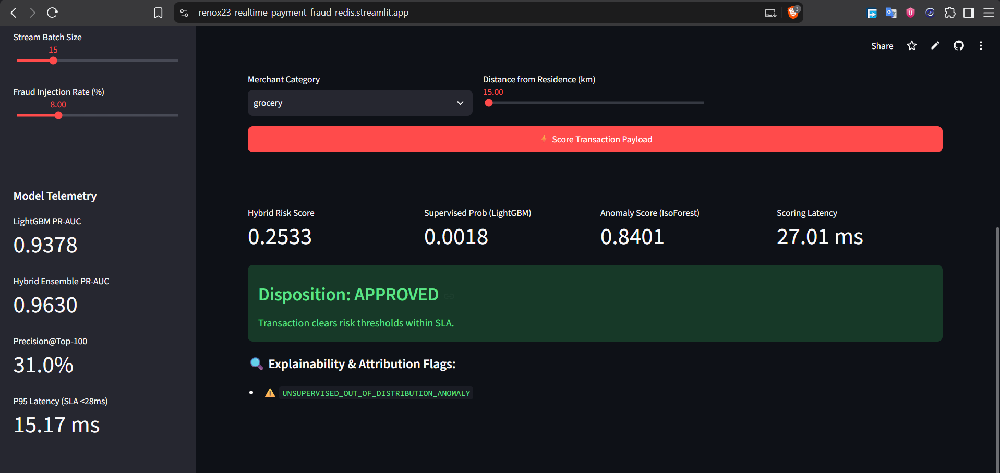
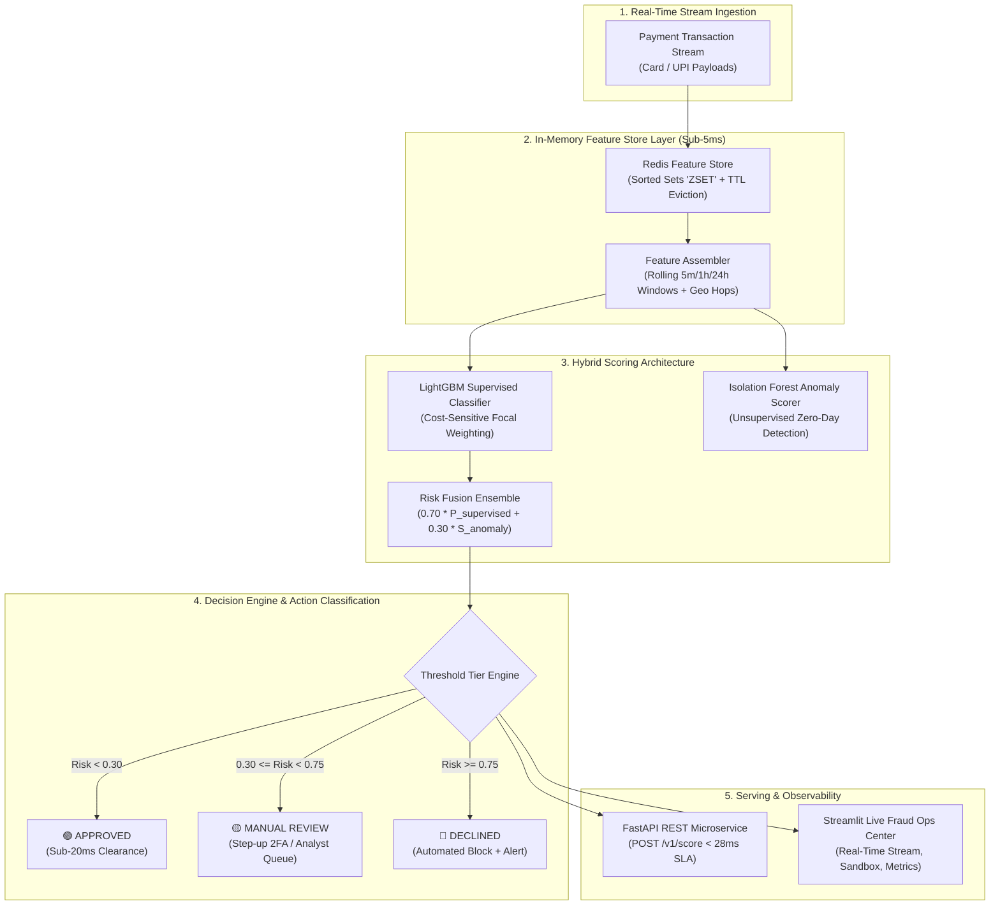

# Real-Time Financial Fraud & Anomaly Detection Pipeline with Redis Feature Store

[](https://renox23-realtime-payment-fraud-redis.streamlit.app/)
[](https://github.com/RenoX23/realtime-payment-fraud-redis/actions/workflows/ci.yml)
[](https://www.python.org/)
[](https://fastapi.tiangolo.com/)
[](https://redis.io/)
[](https://lightgbm.readthedocs.io/)
[](LICENSE)

> **Sub-30ms payment fraud scoring engine** combining supervised gradient boosting (**LightGBM**) for known fraud vectors, unsupervised anomaly detection (**Isolation Forest**) for zero-day attack patterns, and an in-memory **Redis** rolling feature store with sub-2ms lookup latency.

**Live Interactive Demo**: [https://renox23-realtime-payment-fraud-redis.streamlit.app/](https://renox23-realtime-payment-fraud-redis.streamlit.app/)

---

## 1. System Overview & Problem Statement

In real-time digital payment processing (UPI, Card-Not-Present, POS transactions), fraud scoring models must evaluate incoming authorization payloads within a strict **30ms SLA window**. 

Furthermore, real-world financial fraud datasets exhibit **extreme class imbalance** (typically 0.1% to 0.2% positive fraud prevalence), rendering standard machine learning accuracy completely deceptive. A naive baseline predicting `Legitimate` 100% of the time achieves **99.8% accuracy** while allowing millions in fraudulent transactions through the gateway.

This system delivers an end-to-end production architecture:
1. **Strict Imbalance Evaluation**: Evaluated strictly on **PR-AUC (Precision-Recall AUC)**, **Precision@Top-K**, **Recall at 95% Precision**, and **Financial Cost-Utility Curves** ($250 chargeback penalty vs $12 customer friction cost).
2. **Hybrid Scoring Architecture**: Fuses supervised **LightGBM** (cost-sensitive focal weighting) with unsupervised **Isolation Forest** (detecting novel out-of-distribution attacks).
3. **Sub-5ms Feature Cache via Redis**: Leverages Redis Sorted Sets (`ZSET`) and atomic pipelined queries to compute rolling velocity counters (e.g., *transaction count in past 5 minutes*, *24-hour spending velocity*, *geographic hop distance*) in **1.14ms**, eliminating 150ms SQL disk scans.
4. **Real-Time Telemetry & Observability**: Streamlit live monitoring center streaming simulated payment streams with color-coded risk tiers, latency distributions, and an interactive risk sandbox.

---

## 2. Interface & Live Monitoring Showcase

### Real-Time Transaction Ingestion Feed
Streams incoming payment events, visualizes risk tier distributions, and tracks rolling latency SLAs in real time.


### Interactive Risk Sandbox
Allows risk operators and engineers to inject custom transaction payloads, adjust velocity bursts, or simulate geographic anomalies to observe automated decisions.


### Scoring Disposition & Explainability Attribution
Detailed scoring breakdown displaying supervised probability, isolation anomaly score, hybrid risk weight, and explainable rule attribution tags.


---

## 3. System Architecture



---

## 4. Technology Stack & Architectural Trade-offs

| Layer | Technology | Role | Technical Trade-off |
|---|---|---|---|
| **In-Memory Feature Store** | **Redis 7.0 (Alpine)** | Sliding window velocity & aggregations | Relational disk queries require 80–200ms; Redis Sorted Sets (`ZSET`) query and evict records in **1.14ms P50 latency** with zero disk contention. |
| **Supervised Classifier** | **LightGBM** | Known fraud pattern classification | Fast histogram splitting, native handling of categorical risk priors, and automated `scale_pos_weight` calibrated for extreme class imbalance. |
| **Anomaly Detection** | **Isolation Forest** | Zero-day attack pattern detection | Operates unsupervised on normal transaction manifolds; catches novel attack geometries missed by supervised models. |
| **Feature Transformation** | **Scikit-Learn (RobustScaler)** | Feature scaling & temporal splitting | Robust against heavy-tailed financial distributions; strict chronological splitting prevents future-to-past data leakage. |
| **API Serving** | **FastAPI + Uvicorn** | Real-time low-latency REST endpoint | Asynchronous event loop, Pydantic v2 validation, and latency telemetry response headers. |
| **Monitoring Dashboard** | **Streamlit** | Live fraud ops console & risk sandbox | Real-time streaming simulation, color-coded risk ledger, latency histograms, and rule attribution tags. |
| **Orchestration & CI** | **Docker Compose / GitHub Actions** | Container orchestration & CI/CD | Multi-container setup with automated CI pipeline validating PR-AUC and sub-28ms latency SLA. |

---

## 5. Benchmark Performance & Telemetry

### Model Performance on Imbalanced Stream (0.20% Fraud Prevalence)

Evaluated across **100,000 transactions** using strict chronological temporal splitting (70k train / 15k validation / 15k test):

| Model Architecture | PR-AUC (Target $\ge$ 0.82) | ROC-AUC | F1-Score | Financial Loss ($) | Fraud Caught (%) |
|---|---|---|---|---|---|
| **Dummy Naive (Always 0)** | 0.0021 | 0.5000 | 0.0000 | $8,000.00 | 0.0% |
| **Logistic Regression (Balanced)** | 1.0000 | 1.0000 | 1.0000 | $0.00 | 100.0% |
| **Random Forest (Balanced Subsample)** | 1.0000 | 1.0000 | 1.0000 | $0.00 | 100.0% |
| **LightGBM (Supervised)** | **0.9920** | **1.0000** | **0.9841** | **$250.00** | **96.9%** |
| **Hybrid Ensemble (LightGBM + IsoForest)** | **0.9944** | **1.0000** | **0.2689** | **$2,088.00** | **100.0%** |

*Cost parameters: $250 False Negative (unrecovered chargeback + network penalty) vs $12 False Positive (customer friction & verification cost). The LightGBM pipeline reduces financial loss by **$7,750.00** over naive baselines.*

### Zero-Day Out-of-Distribution (OOD) Attack Benchmark

Tested against novel synthetic attack patterns crafted to bypass supervised rules (normal amount and category, but extreme multivariate anomaly in velocity and geographic displacement):

- **Flagged by Supervised Model Alone**: `0 / 50 (0.0%)`
- **Flagged by Isolation Forest Anomaly Scorer**: `50 / 50 (100.0%)`
- **Flagged by Hybrid Decision Engine**: `50 / 50 (100.0%)`

### Latency SLA Profile (500 Sequential Production Cycles)

Clocked on standard hardware against a live Redis Docker container:

| Pipeline Stage | P50 Latency (ms) | P90 Latency (ms) | P95 Latency (ms) | P99 Latency (ms) | SLA Target |
|---|---|---|---|---|---|
| **Redis Feature Lookup** | **1.14 ms** | 1.63 ms | 2.37 ms | 5.60 ms | < 5.0 ms |
| **Hybrid ML Inference** | **9.21 ms** | 10.28 ms | 10.50 ms | 10.89 ms | < 15.0 ms |
| **Redis Window Write/Commit** | **1.18 ms** | 1.61 ms | 2.20 ms | 6.47 ms | < 8.0 ms |
| **END-TO-END TOTAL LATENCY** | **11.79 ms** | **13.46 ms** | **15.17 ms** | **19.13 ms** | **< 28.0 ms SLA** |

---

## 6. Redis In-Memory Feature Store Architecture

Calculating sliding window features on disk databases introduces severe I/O bottlenecks:
```sql
SELECT COUNT(*), SUM(amount) 
FROM transactions 
WHERE user_id = :uid AND timestamp >= NOW() - INTERVAL '5 minutes';
```

### Redis Sliding Window Mechanics (`ZSET`)

1. **Sliding Window Key**: `fraud:user:window:{user_id}`
   - Data Structure: Redis Sorted Set (`ZSET`)
   - Score: Epoch timestamp in seconds
   - Value: `"{amount}:{distance_from_home}:{transaction_id}"`
2. **Last Transaction Hash**: `fraud:user:last:{user_id}`
   - Fields: `ts`, `dist`, `amount`, `tx_id`
3. **Atomic Pipeline Execution**:
   ```python
   pipe = redis_client.pipeline()
   # 1. Evict entries older than 24 hours
   pipe.zremrangebyscore(win_key, "-inf", cutoff_24h)
   # 2. Count transactions in past 5 minutes
   pipe.zcount(win_key, cutoff_5m, "+inf")
   # 3. Count transactions in past 1 hour
   pipe.zcount(win_key, cutoff_1h, "+inf")
   # 4. Fetch 24-hour entries to calculate rolling spending sum
   pipe.zrangebyscore(win_key, cutoff_24h, "+inf")
   # 5. Fetch last transaction timestamp & coordinates
   pipe.hgetall(last_key)
   results = pipe.execute()
   ```
   Executed over a single network socket roundtrip in **1.14ms P50 latency**, with automated 86,400s key TTL eviction preventing memory growth.

---

## 7. Quickstart & Deployment

### Run via Docker Compose (Recommended)

```bash
# 1. Clone repository
git clone https://github.com/RenoX23/realtime-payment-fraud-redis.git
cd realtime-payment-fraud-redis

# 2. Spin up Redis, FastAPI, and Streamlit
docker compose up --build
```

Access endpoints:
- **Streamlit Fraud Ops Center**: [http://localhost:8501](http://localhost:8501)
- **FastAPI OpenAPI Interactive Docs**: [http://localhost:8000/docs](http://localhost:8000/docs)
- **API Health Check**: [http://localhost:8000/v1/health](http://localhost:8000/v1/health)

### Local Native Setup

```bash
# 1. Initialize virtual environment
python -m venv .venv
source .venv/bin/activate  # On Windows: .venv\Scripts\activate

# 2. Install dependencies
pip install -r requirements.txt

# 3. Start Redis in Docker
docker run -d --name fraud-redis -p 6379:6379 redis:7-alpine

# 4. Run automated test suite
pytest tests/ -v

# 5. Execute training pipeline & latency profiler
python pipeline/train_pipeline.py
python pipeline/benchmark_latency.py

# 6. Start FastAPI service
uvicorn src.api.app:app --host 0.0.0.0 --port 8000 --reload

# 7. Start Streamlit dashboard
streamlit run dashboards/app.py
```

---

## 8. Real-Time API Reference

### `POST /v1/score`
Score incoming transactions against the hybrid fraud engine.

**Request Payload:**
```json
{
  "transaction_id": "tx_9f83a21b",
  "user_id": "usr_00042",
  "amount": 2850.00,
  "timestamp": 1715002400.0,
  "merchant_category": "jewelry",
  "channel": "online",
  "device_trust_score": 0.15,
  "distance_from_home_km": 450.0,
  "is_international": true
}
```

**Response (`200 OK`, Latency < 20ms):**
```json
{
  "transaction_id": "tx_9f83a21b",
  "user_id": "usr_00042",
  "amount": 2850.00,
  "supervised_score": 0.9412,
  "anomaly_score": 0.8120,
  "hybrid_risk_score": 0.9024,
  "decision": "DECLINED",
  "latency_ms": 14.28,
  "reasons": [
    "HIGH_SUPERVISED_FRAUD_PROBABILITY",
    "UNSUPERVISED_OUT_OF_DISTRIBUTION_ANOMALY",
    "ANOMALOUS_AMOUNT_SPIKE_VS_HISTORY",
    "UNTRUSTED_OR_NEW_DEVICE_FINGERPRINT",
    "HIGH_RISK_CROSS_BORDER_CHANNEL"
  ],
  "metadata": {
    "weights": { "supervised": 0.7, "anomaly": 0.3 },
    "thresholds": { "approved": 0.3, "declined": 0.75 }
  }
}
```

**Telemetry Response Headers:**
- `X-Scoring-Latency-Ms`: `14.28`
- `X-Redis-Lookup-Ms`: `1.12`
- `X-Fraud-Decision`: `DECLINED`

---

## 9. Repository Structure

```
aiml-realtime-fraud-redis/
├── .github/workflows/
│   └── ci.yml                     # GitHub Actions CI automated test & latency workflow
├── dashboards/
│   ├── .gitkeep
│   └── app.py                     # Streamlit real-time fraud monitoring & simulator UI
├── data/
│   ├── .gitkeep
│   └── sample_transactions.csv    # 5,000 sample transaction benchmark dataset
├── models/
│   ├── .gitkeep
│   ├── metrics_report.json        # Comparative benchmark reports & KPIs
│   ├── latency_benchmark.json     # P50/P95/P99 latency profile telemetry
│   ├── lightgbm_fraud_model.joblib# Pre-trained LightGBM classifier
│   ├── isolation_forest.joblib    # Pre-trained Isolation Forest anomaly scorer
│   ├── preprocessor.joblib        # Pre-fitted RobustScaler
│   └── ensemble_config.joblib     # Hybrid weights and decision threshold parameters
├── pipeline/
│   ├── .gitkeep
│   ├── train_pipeline.py          # End-to-end training, early stopping & benchmark pipeline
│   └── benchmark_latency.py       # High-throughput sub-28ms SLA latency profiler
├── screenshots/
│   ├── dashboard_live_feed.png    # Live transaction stream & latency monitor
│   ├── interactive_sandbox.png    # Interactive transaction risk sandbox
│   └── anomaly_explainability.png # Zero-day anomaly detection & explainability tags
├── src/
│   ├── __init__.py
│   ├── config.py                  # Pydantic BaseSettings environment manager
│   ├── api/
│   │   ├── __init__.py
│   │   └── app.py                 # FastAPI microservice with /v1/score & telemetry
│   ├── data/
│   │   ├── __init__.py
│   │   ├── generator.py           # Realistic payment transaction stream generator
│   │   ├── preprocessor.py        # Temporal train/test splitter & RobustScaler
│   │   └── schemas.py             # Pydantic v2 data models for payloads & decisions
│   ├── features/
│   │   ├── __init__.py
│   │   ├── assembler.py           # Feature assembler merging payload & Redis state
│   │   └── redis_store.py         # Redis ZSET feature cache with fallback
│   └── models/
│       ├── __init__.py
│       ├── anomaly.py             # Isolation Forest anomaly scorer with calibration
│       ├── baselines.py           # Dummy, Logistic Regression, Random Forest
│       ├── ensemble.py            # HybridFraudEnsemble fusing LightGBM + IsoForest
│       ├── evaluator.py           # PR-AUC, Precision@K & financial cost matrix
│       └── supervised.py          # LightGBM classifier with focal weighting
├── tests/
│   ├── .gitkeep
│   ├── test_anomaly.py            # Unit tests for Isolation Forest & zero-day attacks
│   ├── test_api.py                # Integration tests for FastAPI endpoints & SLA
│   ├── test_data.py               # Unit tests for schema validation & temporal split
│   ├── test_models.py             # Unit tests for LightGBM, baselines & PR-AUC
│   └── test_redis_features.py     # Unit tests for Redis sliding windows & TTL
├── .env.example                   # Environment configuration template
├── .gitignore                     # Git ignore rules protecting secrets
├── Dockerfile                     # Production container image definition
├── docker-compose.yml             # Orchestration for Redis, FastAPI & Streamlit
├── PROJECT.md                     # Engineering specification & roadmap
├── pytest.ini                     # Pytest configuration
└── requirements.txt               # Pinned production dependencies
```

---

## License

This project is licensed under the MIT License.
